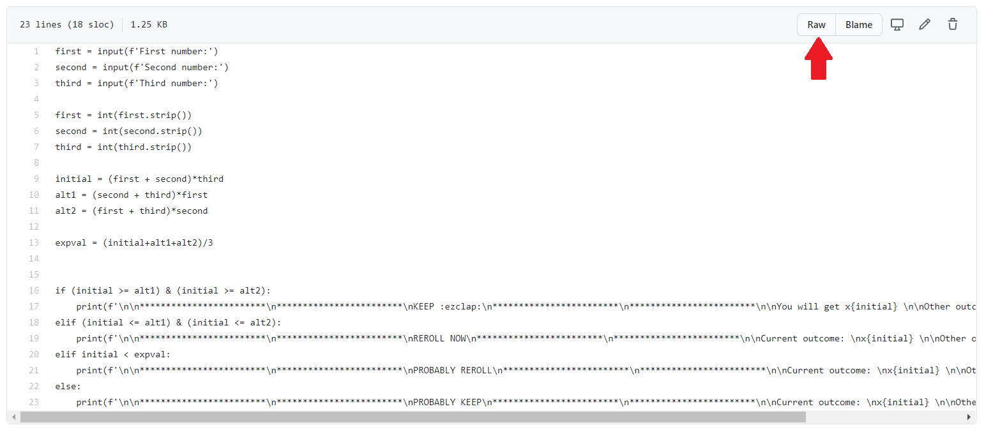
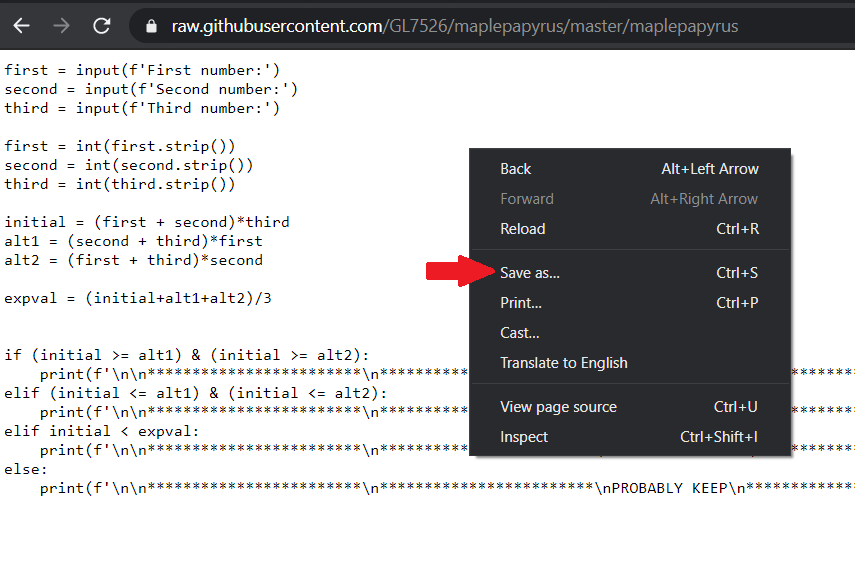
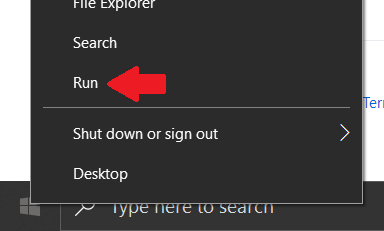
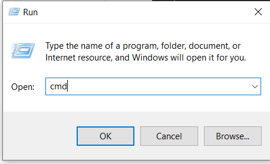
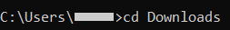
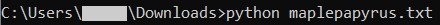
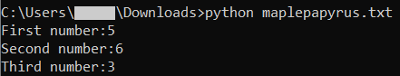
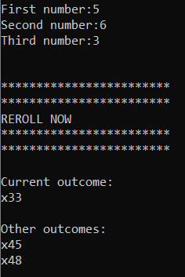

  

# Maple Papyrus
Maple Papyrus is a minigame in the game Maplestory where you obtain 3 numbers sequentially from 1 to 16 to fit the format (a+b)\*c, where a, b, and c are numbers from 1 to 16. You can then either keep your current order or reroll the order. The goal of this minigame is to get as high of a result as possible.
The python script, maplepapyrus, lets you input the 3 numbers and tells you the best course of action to take.

If you want to learn about the math and logic used in the script, you can go to [The Numbers](#thenumbers)

# The Numbers (#thenumbers)
At it's core, Maple Papyrus just a simple game of combinatorics and statistics. We can list out the possible combinations and assign the probabilities to get each of them, which luckily for us, seems to be equal. If our current combination is higher than the expected value of all the possible outcomes, then it is better to keep the current combination. Otherwise, we should reroll.

Listed out, there are six possible combinations:
 
<ul>
  <li>(a+b)*c</li>

  <li>(a+c)*b</li>

  <li>(b+a)*c</li>

  <li>(b+c)*a</li>

  <li>(c+a)*b</li>

  <li>(c+b)*a</li>
</ul>

You might have noticed that thanks to the commutative property of addition, we really have only three possible outcomes:
 

<ul>
  <li>(a+b)*c</li>
  
  <li>(a+c)*b</li>
  
  <li>(b+c)*a</li>
</ul>
These three values are initial, alt1, and alt2, in the script.
 
The expected value would be the sum of these three values divided by 3, and with this, we can tell the user to either keep or reroll their current value.
 

### The Gamblers
However, there's also a chance that the user is willing to take risks, no matter what. An example of this is if someone rolls something like (1+16)\*15.
 
 
Their current outcome would be 255. If they reroll, they can either get the same value, 256, or 31. Logically, it would make sense to keep their current outcome because the potential loss greatly outweighs how much they can gain. However, for someone who may want to gamble for any potential gain, they can, and will reroll. Therefore, it may be better to have four different recommendations in the script.
 
 
<b>The obvious recommendations</b>
 
The two obvious recommendations should occur when the user already has either the highest or lowest possible outcome. 
 
If the person obtains the highest possible outcome, they should never reroll, and if the person obtains the lowest possible outcome, they should always reroll.
 
 
<b>The less obvious recommendations</b>
 
The other two recommendations occur when the user obtains a middling value. It's not the highest possible one, nor the lowest possible one. This is where we use our previous logic and either: 
<ul>
  <li>suggest to reroll if what they have is below the expected value</li>
  or
  <li>suggest to keep their current value if what they have is already above the expected value</li>
</ul>
 
These suggestions allow the user to use their discretion in their choice, as we have already provided an objective recommendation.
<!-- write about how these are only suggestions and allow the user to know that they can still reroll even though we say "should keep" or smth |||| well...not really objective recommendation. change that -->

# How To Use The Script:
<ol>
  <li>Click on the "maplepapyrus" file</li>
   
  
  <li>Click on "Raw" on the top right:</li>
  

  <li>Press "ctrl + s" or right click the page and click "Save as...":</li>
   
  
  
  <li>A window will appear that will allow you to select where you want to save the file and change it's name.   You can change its download destination or if you're confused or don't care, you can just click "Save" and it will download to your default downloads folder.</li>
   

  <li>If you're on Windows 8 or 10, right click your Window's icon on the bottom left of your screen:</li>
   
  
   
   

  <li>Click "Run":</li>
   
  
   
   
  
  <li>Type "cmd" to open the command prompt. Then click "OK":</li>
   
  
   
   
  
  <li>Type "cd Downloads" and then press "Enter".
   
  If your file got downloaded to another folder, you will have to change directories to that folder instead:</li>
   
    
   
   
  
  <li>Type "python maplepapyrus.txt" and then press "Enter":</li>
   
  
   
   
  
  <li>Type your numbers then press enter for each number:</li>
   
  
   
   
  
  <li>The script will then provide a suggestion on what to do:</li>
   
  
   
  Do note that these outputs are just suggestions, unless they are not, like the one above. You can always act against the recommendations, but this is backed with math.
</ol>
